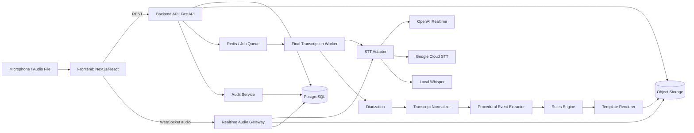
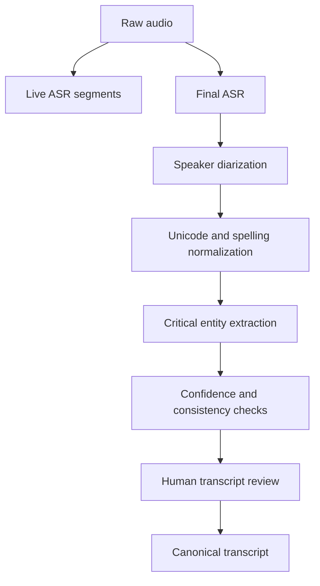
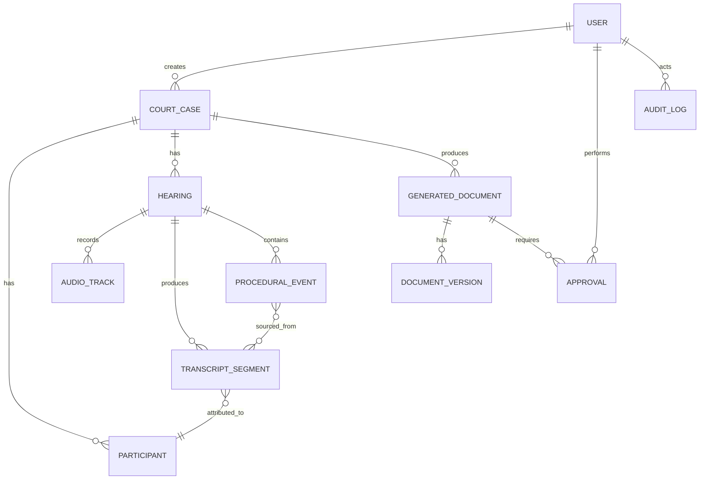

# LexKotib AI — MVP texnik konsepsiyasi va ishlab chiqish spetsifikatsiyasi

**Hujjat versiyasi:** 1.0  
**Sana:** 2026-07-19  
**Maqsadli auditoriya:** frontend dasturchi, backend dasturchi, AI/ML muhandis, prompt/AI quality engineer, yuridik ekspert va product owner  
**Loyiha bosqichi:** tanlov uchun ishlaydigan MVP  
**Asosiy qoida:** MVP sudyaning o‘rniga qaror qabul qilmaydi va huquqiy maslahat bermaydi.

---

## 0. Bir sahifalik qisqacha mazmun

**LexKotib AI** — sud majlisidagi ovozni real vaqtga yaqin rejimda matnga aylantiradigan, gapiruvchilarni protsessual rollar bilan bog‘laydigan, transkript asosida sud majlisi bayonnomasini va oldindan tasdiqlangan takroriy sud hujjatlari loyihalarini shakllantiradigan tizim.

### MVP natijasi

MVP quyidagi to‘liq zanjirni namoyish qilishi kerak:

```text
Sud ishi yaratish
    ↓
Ishtirokchilar va rollarni kiritish
    ↓
Mikrofondan audio olish
    ↓
Jonli speech-to-text
    ↓
Majlis yakunida aniq qayta transkripsiya
    ↓
Speaker/rol va yuridik terminlarni tekshirish
    ↓
Strukturali protsessual hodisalar
    ↓
Bayonnoma loyihasi
    ↓
Ajrim / sud buyrug‘i / ijro varaqasi loyihasi
    ↓
Kotib yoki sudya tomonidan tahrir va tasdiq
    ↓
DOCX/PDF eksport + audit log
```

### MVP ichiga kiradi

- sud ishini va majlisni yaratish;
- ishtirokchilarni protsessual rollar bilan kiritish;
- brauzer orqali audio yozish;
- audio fayl yuklash;
- jonli transkripsiya;
- final transkripsiya;
- speaker segmentlari va timestamp;
- yuridik terminlar lug‘ati;
- transkriptni tahrirlash;
- transkript asosida bayonnoma loyihasini yaratish;
- tasdiqlangan shablonlar asosida ayrim takroriy hujjatlarni yaratish;
- hujjatdagi ma’lumotni manba segmenti yoki ish rekvizitiga bog‘lash;
- inson tasdig‘i;
- versiyalar va audit log;
- DOCX/PDF eksport.

### MVP ichiga kirmaydi

- sudya uchun huquqiy maslahatchi;
- ish bo‘yicha yakuniy qarorni tavsiya qilish;
- aybdorlik, javobgarlik yoki da’voni qanoatlantirish masalasini baholash;
- mustaqil ravishda qonun normasini tanlab sud qarori yaratish;
- E-SUD yoki boshqa davlat tizimiga production integratsiya;
- hujjatni inson tasdig‘isiz yuborish yoki imzolash;
- barcha sud turlari va barcha protsessual hujjatlar;
- ovoz biometrik identifikatsiyasi orqali shaxsni qat’iy aniqlash.

### Keyingi bosqich

Sudya maslahatchisi alohida modul sifatida keyin qo‘shiladi. U ham yakuniy qaror chiqarmaydi; faqat ish materiallari va rasmiy qonunchilik bo‘yicha manbali qidiruv yordamchisi bo‘ladi.

---

# 1. Muammo

Sud majlisi kotibi bir vaqtning o‘zida:

- majlisni tashkiliy yuritadi;
- kim nima deganini qayd qiladi;
- protsessual harakatlarni belgilaydi;
- majlis bayonnomasini tayyorlaydi;
- takroriy sud hujjatlari uchun rekvizitlarni qayta kiritadi;
- hujjatlarni tekshiradi va formatlaydi.

Bu jarayonlarda bir xil ma’lumotlar ko‘p marta qayta yoziladi. Ovoz yozuvi, transkript, bayonnoma va keyingi hujjatlar bir-biridan uzilgan bo‘lishi mumkin.

LexKotib AI ushbu ish oqimini bitta tekshiriladigan tizimga birlashtiradi.

---

# 2. Mahsulotning asosiy prinsiplari

## 2.1. Human-in-the-loop

AI natijasi har doim **loyiha** hisoblanadi. Rasmiy hujjat faqat vakolatli inson tekshirganidan keyin tasdiqlanadi.

## 2.2. Source-grounded generation

Hujjatdagi har bir fakt quyidagilardan biriga bog‘langan bo‘lishi kerak:

- ish kartasidagi rekvizit;
- majlis transkriptidagi segment;
- foydalanuvchi tasdiqlagan protsessual hodisa;
- tasdiqlangan hujjat shablonining statik qismi.

Model manbada bo‘lmagan F.I.Sh., sana, summa, modda, talab yoki protsessual qarorni o‘zidan qo‘shmasligi kerak.

## 2.3. Ikki bosqichli transkripsiya

1. **Live pass:** foydalanuvchi majlis vaqtida jonli matnni ko‘radi.
2. **Final pass:** majlis tugagach to‘liq audio qayta ishlanib, aniqroq transcript hosil qilinadi.

Live matn yakuniy bayonnoma uchun bevosita manba bo‘lmaydi. Final transkript tekshiruvdan o‘tadi.

## 2.4. Provider-agnostic arxitektura

STT tizimi faqat bitta bulut servisiga bog‘lanmasligi kerak. Backend umumiy adapter interfeysiga ega bo‘ladi:

- OpenAI Realtime transcription;
- Google Cloud Speech-to-Text;
- lokal Whisper/faster-whisper;
- keyinchalik boshqa provayder.

## 2.5. Template-first document generation

Takroriy sud hujjatlari erkin LLM matni sifatida emas, quyidagi zanjir bilan yaratiladi:

```text
Tasdiqlangan ma’lumotlar
    ↓
JSON Schema
    ↓
Rules engine
    ↓
Tasdiqlangan DOCX shablon
    ↓
Hujjat loyihasi
```

LLM faqat chegaralangan vazifalarda qo‘llanadi:

- protsessual hodisani ajratish;
- transkriptni normallashtirish;
- shablondagi izohlovchi matn variantini shakllantirish.

## 2.6. Auditability

Quyidagilar log qilinadi:

- kim ish yaratdi;
- kim majlisni boshladi va tugatdi;
- qaysi STT model ishladi;
- model konfiguratsiyasi;
- transcriptning barcha versiyalari;
- kim qaysi segmentni tahrir qildi;
- qaysi hujjat qaysi ma’lumotlardan yaratildi;
- kim hujjatni tasdiqladi;
- eksport qachon bajarildi.

---

# 3. Terminlar

| Termin | Mazmuni |
|---|---|
| ASR/STT | Ovozli nutqni matnga aylantirish |
| TTS | Matnni ovozga aylantirish; ushbu MVPning asosiy qismi emas |
| Interim transcript | Hali yakunlanmagan, jonli yangilanadigan matn |
| Final transcript | STT provayderi segmentni yakunlagan matn |
| Canonical transcript | Normallashtirilgan va foydalanuvchi tasdiqlagan transkript |
| Speaker diarization | “Kim qachon gapirdi?” segmentatsiyasi |
| Speaker role mapping | SPEAKER_01 kabi yorliqni “Sudya”, “Da’vogar vakili” roliga bog‘lash |
| Procedural event | Iltimosnoma, tushuntirish, e’tiroz, tanaffus, hujjat taqdim etish kabi hodisa |
| Protocol | Sud majlisi bayonnomasi |
| Document template | Yuridik ekspert tasdiqlagan DOCX hujjat shabloni |
| Traceability | Hujjatdagi faktni original manbaga qayta bog‘lash |
| Critical field | F.I.Sh., tashkilot nomi, sana, summa, ish raqami, hujjat raqami kabi xatosi jiddiy bo‘lgan maydon |

---

# 4. Foydalanuvchilar va rollar

## 4.1. System administrator

- foydalanuvchilarni yaratadi;
- rollarni beradi;
- template versiyalarini boshqaradi;
- STT va AI konfiguratsiyasini ko‘radi;
- audit logga kiradi.

## 4.2. Sud kotibi

- ish va majlis yaratadi;
- ishtirokchilarni kiritadi;
- audio yozuvni boshlaydi;
- jonli transcriptni kuzatadi;
- speakerlarni rollarga bog‘laydi;
- transkriptni tahrir qiladi;
- bayonnoma yaratadi;
- hujjat loyihasini tayyorlaydi;
- tasdiqqa yuboradi.

## 4.3. Sudya

MVPda:

- tasdiqqa kelgan bayonnoma va hujjat loyihasini ko‘radi;
- tahrir kiritadi;
- tasdiqlaydi yoki qaytaradi.

Sudya uchun huquqiy maslahatchi MVPda yo‘q.

## 4.4. Yuridik ekspert / template administrator

- hujjat shablonlarini tekshiradi;
- majburiy maydonlarni belgilaydi;
- hujjat yaratish qoidalarini tasdiqlaydi;
- test case’larni ishlab chiqadi.

## 4.5. Demo operator

Tanlovdagi demo uchun alohida yengillashtirilgan rol bo‘lishi mumkin. U demo ishlarini yaratadi, ammo production ma’lumotlarga ega bo‘lmaydi.

---

# 5. Asosiy foydalanuvchi ssenariylari

## UC-01. Yangi ish yaratish

1. Kotib “Yangi ish”ni bosadi.
2. Ish turi tanlanadi.
3. Ish raqami, sud, sudya va taraflar kiritiladi.
4. Ishtirokchilar protsessual rollar bilan bog‘lanadi.
5. Maxsus terminlar lug‘ati avtomatik shakllanadi.
6. Ish saqlanadi.

**Natija:** yangi `CourtCase` va uning `Participant` yozuvlari mavjud.

## UC-02. Sud majlisini boshlash

1. Kotib ishni ochadi.
2. “Yangi majlis” yaratadi.
3. Audio qurilmalar tekshiriladi.
4. Ishtirokchilar va mikrofon kanallari tekshiriladi.
5. “Yozishni boshlash” bosiladi.
6. Backend audio session ochadi.
7. Jonli transcript kelishni boshlaydi.

**Natija:** audio saqlanadi, interim/final segmentlar ekranga chiqadi.

## UC-03. Speakerlarni aniqlash

Eng ishonchli tartib:

1. Alohida mikrofon kanali bo‘lsa, kanal rolga bog‘lanadi.
2. Bitta kanal bo‘lsa, post-processing diarization bajariladi.
3. Kotib `SPEAKER_01`, `SPEAKER_02` yorliqlarini rollarga bir marta bog‘laydi.
4. Mapping barcha tegishli segmentlarga qo‘llanadi.

**Natija:** har bir transcript segmentida `speaker_label` va imkon qadar `participant_id` mavjud.

## UC-04. Majlisni yakunlash

1. Kotib “Majlisni tugatish”ni bosadi.
2. Audio oqimi yopiladi.
3. Audio faylning checksum/hash qiymati olinadi.
4. Final ASR job ishga tushadi.
5. Diarization va normallashtirish bajariladi.
6. Jonli matn final matn bilan taqqoslanadi.
7. Past ishonchli segmentlar belgilanadi.

**Natija:** tahrirlash uchun final transcript tayyor.

## UC-05. Transkriptni tekshirish

1. Kotib final transcriptni ochadi.
2. Har bir segmentga tegishli audio bo‘lagini qayta eshitishi mumkin.
3. F.I.Sh., sana, summa va yuridik terminlar alohida highlight qilinadi.
4. Tahrir kiritilganda original ASR matni saqlanadi.
5. Kotib canonical transcriptni tasdiqlaydi.

**Natija:** protocol generation uchun tasdiqlangan transcript mavjud.

## UC-06. Bayonnoma yaratish

1. Tizim canonical transcriptni segmentlarga ajratadi.
2. Protsessual hodisalar JSON shaklida chiqariladi.
3. Rules engine majburiy qismlarni tekshiradi.
4. Bayonnoma shabloni to‘ldiriladi.
5. Har bir generatsiya qilingan qismning manbasi ko‘rsatiladi.
6. Kotib tahrirlaydi.
7. Sudyaga tasdiqqa yuboradi.

## UC-07. Takroriy sud hujjatini yaratish

MVPdagi boshlang‘ich hujjatlar:

- standart ajrimlarning kelishilgan turlari;
- sud buyrug‘i loyihasi;
- ijro varaqasi loyihasi.

Jarayon:

1. Hujjat turi tanlanadi.
2. Tizim kerakli rekvizitlar ro‘yxatini ko‘rsatadi.
3. Ish kartasi, tasdiqlangan transcript va protocol eventlardan maydonlar olinadi.
4. Rules engine majburiy maydonlarni tekshiradi.
5. Yetishmagan maydonlar bo‘lsa generatsiya bloklanadi.
6. Hujjat loyihasi yaratiladi.
7. Foydalanuvchi tahrir va tasdiq qiladi.

---

# 6. MVP funksional talablar

## FR-01. Autentifikatsiya va avtorizatsiya

- email/login va parol;
- JWT access token + refresh token yoki secure session cookie;
- role-based access control;
- parol hashing;
- login audit;
- demo muhitida oldindan yaratilgan test akkauntlari.

## FR-02. Ishlarni boshqarish

- ish yaratish;
- ishni tahrirlash;
- ishni arxivlash;
- ishlar ro‘yxati;
- qidiruv;
- status;
- ishtirokchilar;
- ish turi;
- sud va sudya ma’lumotlari;
- maxsus lug‘at.

## FR-03. Majlislarni boshqarish

- bir ishga bir nechta majlis;
- boshlash, pause, resume, stop;
- texnik uzilishdan keyin davom ettirish;
- audio duration;
- session status;
- live connection status;
- STT provider va model metadata.

## FR-04. Audio capture

- brauzer mikrofoni;
- qo‘llab-quvvatlanadigan browserlar ro‘yxati;
- qurilmani tanlash;
- input level indikator;
- mute holatini aniqlash;
- lokal buffering;
- audio chunklarni backendga uzatish;
- audio fayl yuklash;
- original audio faylni saqlash.

## FR-05. Jonli transkript

- interim segment;
- final segment;
- timestamp;
- speaker label;
- connection state;
- kechikish indikatori;
- xato bo‘lsa reconnect;
- transkriptni scroll lock bilan ko‘rsatish;
- final bo‘lmagan matnni vizual ajratish.

## FR-06. Final transkript

- majlisdan keyingi qayta ishlash;
- diarization;
- punktuatsiya;
- termin normallashtirish;
- critical field detection;
- past confidence segmentlar;
- audio bilan vaqt bo‘yicha bog‘lanish;
- original va tahrirlangan versiya.

## FR-07. Transcript editor

- segment matnini tahrirlash;
- segment speakerini o‘zgartirish;
- segmentni bo‘lish;
- segmentlarni birlashtirish;
- timestampni ko‘rish;
- aynan segment audiosini eshitish;
- “verified” belgisi;
- tahrirlar tarixi;
- qidirish;
- critical field bo‘yicha navigatsiya.

## FR-08. Protocol event extraction

Minimal event turlari:

```text
HEARING_OPENED
IDENTITY_VERIFIED
RIGHTS_EXPLAINED
CLAIM_EXPLAINED
RESPONSE_GIVEN
OBJECTION_RAISED
MOTION_SUBMITTED
MOTION_DISCUSSION
EVIDENCE_SUBMITTED
EVIDENCE_EXAMINED
QUESTION_ASKED
ANSWER_GIVEN
BREAK_ANNOUNCED
HEARING_POSTPONED
RULING_ANNOUNCED
HEARING_CLOSED
OTHER
```

Har bir event quyidagilarga ega:

- event type;
- speaker/participant;
- start/end timestamp;
- source segment IDs;
- verbatim text;
- normalized summary;
- confidence;
- human verification status.

## FR-09. Bayonnoma generatori

- tasdiqlangan template;
- ish rekvizitlarini avtomatik olish;
- protsessual hodisalarni xronologik joylashtirish;
- majburiy bo‘limlarni tekshirish;
- yetishmayotgan bo‘limlarni ko‘rsatish;
- manba traceability;
- tahrirlash;
- versiyalar;
- tasdiqqa yuborish;
- DOCX/PDF eksport.

## FR-10. Sud hujjatlari generatori

Har bir hujjat turi uchun:

- `template_code`;
- `template_version`;
- `input_schema`;
- `validation_rules`;
- `rendering_template`;
- `approval_workflow`.

MVPda hujjat turlari yuridik ekspert tomonidan yakuniy tasdiqlanadi. Texnik jamoa hujjat mazmunini mustaqil belgilamaydi.

## FR-11. Tasdiqlash workflow’i

Statuslar:

```text
DRAFT
AI_GENERATED
UNDER_REVIEW
CHANGES_REQUESTED
APPROVED
EXPORTED
ARCHIVED
```

- kim tasdiqlashi kerakligi;
- qaytarish sababi;
- tahrirlar;
- approval timestamp;
- final lock.

## FR-12. Audit log

Audit yozuvi kamida:

```json
{
  "id": "audit_uuid",
  "actor_id": "user_uuid",
  "action": "TRANSCRIPT_SEGMENT_UPDATED",
  "entity_type": "TranscriptSegment",
  "entity_id": "segment_uuid",
  "before": {},
  "after": {},
  "ip_address": "masked-or-secured",
  "created_at": "2026-07-19T10:00:00+05:00"
}
```

---

# 7. Nofunksional talablar

## NFR-01. Maxfiylik

MVP va demo uchun:

- faqat sintetik yoki anonimlashtirilgan materiallardan foydalanish;
- real sud ma’lumotlari alohida ruxsatsiz bulut provayderiga yuborilmasligi;
- audio va transcript transportda TLS bilan himoyalanishi;
- storage shifrlanishi;
- loglarda maxfiy matn yozilmasligi;
- faylga kirish signed URL yoki backend proxy orqali bo‘lishi.

O‘zbekistonning shaxsga doir ma’lumotlar bo‘yicha amaldagi talablarini production pilotdan oldin alohida legal/compliance reviewdan o‘tkazish zarur. [R6]

## NFR-02. Ishonchlilik

- audio chunk yo‘qolsa qayta yuborish;
- vaqtinchalik internet uzilishida lokal buffer;
- idempotent finalize;
- background job retry;
- server restartdan keyin session metadata tiklanishi;
- original audio hech qachon AI processing natijasi bilan overwrite qilinmasligi.

## NFR-03. Tezlik bo‘yicha MVP targetlari

| Ko‘rsatkich | MVP target |
|---|---:|
| Interim transcript p95 | 2.5 sekunddan kam |
| Final segment p95 | 6 sekunddan kam |
| Majlis stop bosilgandan final job boshlanishi | 10 sekunddan kam |
| 60 daqiqalik audio final processing | 20 daqiqadan kam |
| Bayonnoma draft generatsiyasi | 60 sekunddan kam |
| Sahifa asosiy API p95 | 500 ms dan kam, AI joblardan tashqari |

Bu targetlar real audio va tanlangan provayder benchmarkidan keyin qayta ko‘rib chiqiladi.

## NFR-04. AI sifati bo‘yicha MVP targetlari

| Ko‘rsatkich | Boshlang‘ich target |
|---|---:|
| Nazoratli demo audioda WER | 20% yoki yaxshiroq |
| Critical entity exact match | 90%+ |
| Speaker role to‘g‘riligi | 85%+ yoki manual mapping bilan 100% |
| Hujjatdagi maydonlarning manbaga bog‘lanishi | 100% |
| Manbada yo‘q kritik fakt | 0 |
| Bayonnomada critical omission | 0, human reviewdan keyin |
| JSON schema validation | 100% |

WER yakka o‘zi yetarli metrika emas. F.I.Sh., sana, summa, ish raqami va protsessual hodisa kabi critical elementlar alohida baholanadi.

## NFR-05. Kuzatuvchanlik

- request ID;
- session ID;
- job ID;
- provider latency;
- token/audio seconds usage;
- error rate;
- reconnect count;
- queue depth;
- model version;
- prompt/schema version;
- audit log.

## NFR-06. Brauzer qo‘llab-quvvatlashi

MVP uchun:

- Chrome/Chromium desktop — asosiy;
- Edge desktop — qo‘llab-quvvatlash;
- mobil browser — MVPdan tashqari;
- Safari/Firefox — keyingi bosqich yoki best-effort.

---

# 8. Tavsiya etiladigan texnik arxitektura

## 8.1. Yuqori darajadagi arxitektura



## 8.2. Tavsiya etiladigan stack

### Frontend

- Next.js yoki React + TypeScript;
- Web Audio API / MediaRecorder yoki AudioWorklet;
- WebSocket client;
- TanStack Query;
- React Hook Form;
- Zod;
- rich text editor: TipTap yoki Lexical;
- waveform/audio playback: WaveSurfer.js yoki custom player;
- component library: jamoa tanlovi.

### Backend

- Python 3.12+;
- FastAPI;
- SQLAlchemy 2;
- Alembic;
- PostgreSQL;
- Redis;
- Celery, Dramatiq yoki Arq;
- MinIO/S3-compatible storage;
- Pydantic schemas;
- WebSocket gateway;
- `docxtpl` yoki OOXML asosidagi renderer;
- LibreOffice headless yoki boshqa server-side converter faqat PDF preview/export uchun.

### AI/ML

- STT adapter layer;
- live provider benchmark;
- final provider benchmark;
- lokal Whisper/faster-whisper eksperimenti;
- NVIDIA NeMo yoki muqobil diarization;
- LLM structured outputs;
- deterministic normalizers;
- critical entity validator;
- prompt/schema registry;
- evaluation pipeline.

### Infra

- Docker Compose — local development;
- GitHub/GitLab CI;
- staging environment;
- secrets manager yoki kamida `.env`ni repoga kiritmaslik;
- Nginx/Traefik;
- HTTPS;
- monitoring: OpenTelemetry + Grafana/Sentry variantlari.

---

# 9. STT arxitekturasi

## 9.1. Nega provider adapter kerak?

Hozirgi servislar turli imkoniyat beradi:

- OpenAI Realtime transcription browser yoki server audio pipeline uchun WebRTC/WebSocket orqali transcript delta qaytaradi. [R1]
- Google Cloud Speech-to-Text streaming audio natijalarini real vaqtga yaqin qaytaradi; streaming API gRPC orqali ishlaydi. [R2]
- Google STT’da o‘zbek tili `uz-UZ` qo‘llab-quvvatlanadigan modellarda mavjud, ammo model/region/feature holati o‘zgarishi mumkin va jamoa joriy hujjatni tekshirishi kerak. [R3]
- OpenAI Whisper ko‘p tilli speech recognition uchun ochiq model bo‘lib, lokal ishlatish mumkin. [R4]
- Speaker diarization STTdan alohida vazifa bo‘lib, “kim qachon gapirdi?”ni aniqlaydi. NVIDIA NeMo bunday pipeline’larni taqdim etadi. [R5]

Shuning uchun provider nomi domain model ichiga yozilmaydi.

## 9.2. Adapter interfeysi

```python
from typing import AsyncIterator, Protocol

class STTProvider(Protocol):
    async def start_live_session(
        self,
        *,
        session_id: str,
        language: str,
        vocabulary: list[str],
        audio_format: dict
    ) -> None:
        ...

    async def send_audio(self, chunk: bytes) -> None:
        ...

    async def events(self) -> AsyncIterator[dict]:
        ...

    async def close_live_session(self) -> None:
        ...

    async def transcribe_file(
        self,
        *,
        file_uri: str,
        language: str,
        vocabulary: list[str],
        diarization: bool
    ) -> dict:
        ...
```

## 9.3. Audio format

MVP tavsiyasi:

- browser capture: 48 kHz;
- backend/provider uchun kerakli formatga konvertatsiya;
- mono yoki multi-channel;
- PCM16 yoki provider talab qilgan format;
- 100–250 ms chunk;
- har chunkda sequence number;
- serverda original audio containerga yozib borish.

Google tavsiyasida streaming audio uchun 100 ms frame latency va samaradorlik o‘rtasidagi amaliy muvozanat sifatida ko‘rsatilgan. [R7]

## 9.4. Live session eventlari

Frontend va backend o‘rtasidagi WebSocket eventlari:

### Client → server

```json
{
  "type": "audio.session.start",
  "hearing_id": "uuid",
  "codec": "pcm_s16le",
  "sample_rate": 24000,
  "channels": 1
}
```

```json
{
  "type": "audio.chunk",
  "sequence": 145,
  "timestamp_ms": 14500,
  "payload_base64": "..."
}
```

```json
{
  "type": "audio.session.stop"
}
```

### Server → client

```json
{
  "type": "transcript.interim",
  "segment_key": "provider-temp-18",
  "text": "Da’vogar vakili...",
  "start_ms": 14200,
  "end_ms": 16800
}
```

```json
{
  "type": "transcript.final",
  "segment_id": "uuid",
  "speaker_label": "SPEAKER_01",
  "text": "Da’vogar vakili iltimosnoma bildirdi.",
  "start_ms": 14200,
  "end_ms": 18150,
  "confidence": 0.91
}
```

```json
{
  "type": "session.warning",
  "code": "HIGH_LATENCY",
  "message": "STT javobi kechikmoqda."
}
```

## 9.5. Ulanish uzilganda

Frontend:

1. audio chunklarni IndexedDB yoki memory ring bufferda vaqtincha saqlaydi;
2. connection qaytganda ketma-ketlik bo‘yicha yuboradi;
3. server `last_ack_sequence` qaytaradi;
4. duplicate chunklar idempotent ravishda e’tiborsiz qoldiriladi.

Backend:

- har chunkni `hearing_id + sequence` orqali deduplicate qiladi;
- provider session uzilsa yangi session ochadi;
- original audio yozuvini davom ettiradi;
- transcriptda discontinuity marker yaratadi.

## 9.6. Speaker strategiyasi

### Variant A — multi-channel

Eng yaxshi pilot arxitekturasi:

| Kanal | Rol |
|---|---|
| 1 | Sudya |
| 2 | Kotib |
| 3 | Da’vogar tomoni |
| 4 | Javobgar tomoni |

Kanal rolga bog‘langan bo‘lsa, AI speaker identity taxminiga kamroq bog‘lanadi.

### Variant B — bitta mikrofon

1. final audio diarization qilinadi;
2. `SPEAKER_01`, `SPEAKER_02` segmentlari olinadi;
3. kotib UI orqali speakerlarni protsessual rollarga bog‘laydi;
4. mapping barcha segmentlarga qo‘llanadi.

### MVP qarori

Realtime speaker identification majburiy emas. Realtime ekranda vaqtinchalik speaker label bo‘lishi mumkin. Final bayonnoma uchun speaker mapping kotib tomonidan tasdiqlanishi shart.

## 9.7. Dinamik lug‘at

Har ish uchun vocabulary avtomatik tuziladi:

- taraflarning F.I.Sh. va tashkilot nomlari;
- vakillar;
- sudya va kotib;
- shartnoma/hujjat raqamlari;
- joy nomlari;
- yuridik terminlar;
- ish turiga xos iboralar.

```json
{
  "terms": [
    {"text": "Iqtisodiy protsessual kodeks", "weight": 1.0},
    {"text": "da’vogar", "weight": 1.0},
    {"text": "javobgar", "weight": 1.0},
    {"text": "ijro varaqasi", "weight": 1.0}
  ]
}
```

Provayder vocabulary/prompt adaptationni qo‘llamasa ham, bu lug‘at post-processing validatorida ishlatiladi.

---

# 10. Transcript pipeline



## 10.1. Saqlanadigan transcript qatlamlari

1. **Raw ASR:** provayder qaytargan original natija.
2. **Normalized ASR:** imlo, apostrof, bo‘shliq va punktuatsiya normallashtirilgan.
3. **Human edited:** kotib tahrirlagan matn.
4. **Canonical:** tasdiqlangan yakuniy transkript.

Hech bir qatlam oldingisini o‘chirib yubormaydi.

## 10.2. O‘zbekcha normalizatsiya

Quyidagilar bir xil canonical shaklga keltiriladi:

- `o‘`, `o'`, `o’`, `oʻ`;
- `g‘`, `g'`, `g’`, `gʻ`;
- Unicode quote va dashlar;
- ortiqcha bo‘shliqlar;
- lotin/kirill variantlari — original saqlangan holda;
- sanalar;
- pul birliklari;
- tashkilot qisqartmalari.

Misol:

```json
{
  "raw": "ellik million sum",
  "normalized_text": "ellik million so‘m",
  "normalized_value": 50000000,
  "confidence": 0.94
}
```

Raqam normalizatsiyasi original transcriptni o‘zgartirmasligi kerak. `raw` va `normalized_value` alohida saqlanadi.

## 10.3. Critical field validator

Quyidagilar alohida aniqlanadi:

- F.I.Sh.;
- tashkilot;
- ish raqami;
- sana;
- vaqt;
- summa;
- foiz;
- hujjat raqami;
- qonun/modda tilga olingan bo‘lsa;
- manzil.

Tekshiruvlar:

- ish kartasi bilan moslik;
- bir xil ismning turli yozilishi;
- sana formatlari;
- summa matni va raqamining mosligi;
- past confidence;
- ASR variantlari o‘rtasidagi farq.

---

# 11. Protsessual hodisalarni ajratish

## 11.1. Muhim prinsip

LLM transkriptni to‘liq “qayta yozib” yubormaydi. U mavjud segmentlardan strukturali hodisalarni ajratadi.

## 11.2. JSON Schema namunasi

```json
{
  "event_id": "uuid",
  "event_type": "MOTION_SUBMITTED",
  "participant_id": "uuid-or-null",
  "speaker_role": "CLAIMANT_REPRESENTATIVE",
  "start_ms": 864000,
  "end_ms": 878000,
  "source_segment_ids": ["seg-112", "seg-113"],
  "verbatim_text": "Hurmatli sud, javobgardan...",
  "normalized_summary": "Da’vogar vakili hujjatni talab qilib olish haqida iltimosnoma bildirdi.",
  "confidence": 0.94,
  "requires_human_review": true,
  "verified_by": null
}
```

Structured outputs/JSON Schema model natijasining belgilangan sxemaga mos bo‘lishini kuchaytiradi, ammo manba ma’lumot yetarli bo‘lmasa model baribir noto‘g‘ri mazmun yaratishi mumkin. Shu sababli schema validation human review va source traceability o‘rnini bosmaydi. [R8]

## 11.3. Extraction qoidalari

- event faqat source segment mavjud bo‘lsa yaratiladi;
- source segment IDlar majburiy;
- `normalized_summary` verbatim matndan tashqariga chiqmasligi kerak;
- sudyaning protsessual qarori aniq e’lon qilinmagan bo‘lsa `RULING_ANNOUNCED` yaratilmaydi;
- noaniqlikda `OTHER` yoki `requires_human_review=true`;
- model huquqiy oqibat chiqarmaydi.

---

# 12. Bayonnoma generatori

## 12.1. Input

```json
{
  "case": {},
  "hearing": {},
  "participants": [],
  "verified_events": [],
  "canonical_transcript_id": "uuid",
  "template_code": "ECONOMIC_HEARING_PROTOCOL",
  "template_version": "1.0"
}
```

## 12.2. Bayonnoma tarkibi

Yuridik ekspert bilan tasdiqlanadigan umumiy bloklar:

- sud va ish rekvizitlari;
- majlis sanasi, vaqti va joyi;
- sud tarkibi;
- kotib;
- ishtirokchilar;
- kelgan/kelmagan shaxslar;
- majlisning ochilishi;
- huquqlar tushuntirilishi;
- taraflarning tushuntirishlari;
- iltimosnomalar va e’tirozlar;
- dalillarni ko‘rish;
- sud tomonidan e’lon qilingan protsessual harakatlar;
- tanaffus yoki qoldirish;
- majlis yakuni;
- tasdiqlovchi rekvizitlar.

## 12.3. Traceability

Bayonnoma editorida har bir AI yaratgan paragraf yonida:

- manba transcript segmentlari;
- timestamp;
- audio playback;
- confidence;
- “verified” holati

ko‘rinadi.

## 12.4. Generatsiya qilish mumkin bo‘lmagan holatlar

- canonical transcript tasdiqlanmagan;
- ishtirokchilar noma’lum;
- majlis boshlanish/tugash vaqti yo‘q;
- required eventlar bo‘yicha noaniqlik;
- template versiyasi aktiv emas;
- critical fieldlar conflict holatida;
- hujjat uchun kerakli protsessual qaror manbada mavjud emas.

---

# 13. Takroriy sud hujjatlari generatori

## 13.1. MVP uchun hujjat toifalari

Yuridik ekspert tanlaydi va aniq ro‘yxatni freeze qiladi. Boshlang‘ich kandidat:

1. bayonnoma;
2. standart protsessual ajrimlarning cheklangan ro‘yxati;
3. sud buyrug‘i loyihasi;
4. ijro varaqasi loyihasi.

Har bir hujjat alohida feature flag ostida bo‘ladi.

## 13.2. Template katalogi

```json
{
  "template_code": "EXECUTION_WRIT_V1",
  "document_type": "EXECUTION_WRIT",
  "title": "Ijro varaqasi loyihasi",
  "version": "1.0.0",
  "status": "ACTIVE",
  "input_schema_version": "1.0",
  "ruleset_version": "1.0",
  "file_uri": "s3://templates/...",
  "approved_by": "legal-expert-id",
  "approved_at": "2026-07-19T10:00:00+05:00"
}
```

## 13.3. Rules engine

Rules engine oddiy Python/TypeScript kod yoki deklarativ qoidalar orqali:

- required field;
- field format;
- date comparison;
- amount consistency;
- participant role;
- document status;
- approval prerequisite;
- source presence

kabi talablarni tekshiradi.

Misol:

```python
def validate_execution_writ(data):
    errors = []

    if not data.get("enforceable_document_id"):
        errors.append("Ijro asos bo‘lgan hujjat ko‘rsatilmagan.")

    if data.get("creditor_name") is None:
        errors.append("Undiruvchi nomi mavjud emas.")

    if data.get("debtor_name") is None:
        errors.append("Qarzdor nomi mavjud emas.")

    if data.get("amount") is not None and data["amount"] < 0:
        errors.append("Summa manfiy bo‘lishi mumkin emas.")

    return errors
```

## 13.4. Renderer

Tavsiya:

- yuridik ekspert tasdiqlagan DOCX;
- `{{ case_number }}` kabi placeholder;
- shartli bloklar;
- sahifa raqami, header/footer;
- final DOCX;
- PDF preview;
- template version metadata.

---

# 14. Ma’lumotlar modeli

## 14.1. Entity diagram



## 14.2. `court_cases`

```text
id UUID PK
case_number VARCHAR
court_name VARCHAR
court_type ENUM
case_type ENUM
judge_id UUID
status ENUM
metadata JSONB
created_by UUID
created_at TIMESTAMPTZ
updated_at TIMESTAMPTZ
archived_at TIMESTAMPTZ NULL
```

## 14.3. `participants`

```text
id UUID PK
case_id UUID FK
display_name VARCHAR
organization_name VARCHAR NULL
role ENUM
identifier JSONB
language_preferences JSONB
voice_reference_uri VARCHAR NULL
created_at TIMESTAMPTZ
```

## 14.4. `hearings`

```text
id UUID PK
case_id UUID FK
scheduled_at TIMESTAMPTZ
started_at TIMESTAMPTZ NULL
ended_at TIMESTAMPTZ NULL
status ENUM
live_stt_provider VARCHAR
live_stt_model VARCHAR
final_stt_provider VARCHAR
final_stt_model VARCHAR
audio_duration_ms BIGINT
created_by UUID
```

## 14.5. `audio_tracks`

```text
id UUID PK
hearing_id UUID FK
channel_no INTEGER
mapped_role ENUM NULL
storage_uri VARCHAR
codec VARCHAR
sample_rate INTEGER
checksum_sha256 VARCHAR
size_bytes BIGINT
created_at TIMESTAMPTZ
```

## 14.6. `transcript_segments`

```text
id UUID PK
hearing_id UUID FK
audio_track_id UUID NULL
provider_segment_id VARCHAR NULL
sequence_no INTEGER
start_ms BIGINT
end_ms BIGINT
speaker_label VARCHAR NULL
participant_id UUID NULL
raw_text TEXT
normalized_text TEXT
human_text TEXT NULL
canonical_text TEXT
confidence NUMERIC NULL
status ENUM
is_critical_reviewed BOOLEAN
created_at TIMESTAMPTZ
updated_at TIMESTAMPTZ
```

## 14.7. `procedural_events`

```text
id UUID PK
hearing_id UUID FK
event_type ENUM
participant_id UUID NULL
speaker_role ENUM NULL
start_ms BIGINT
end_ms BIGINT
verbatim_text TEXT
normalized_summary TEXT
confidence NUMERIC
review_status ENUM
model_metadata JSONB
created_at TIMESTAMPTZ
```

## 14.8. `event_source_segments`

```text
event_id UUID FK
segment_id UUID FK
PRIMARY KEY(event_id, segment_id)
```

## 14.9. `generated_documents`

```text
id UUID PK
case_id UUID FK
hearing_id UUID NULL
document_type ENUM
template_code VARCHAR
template_version VARCHAR
status ENUM
source_snapshot JSONB
created_by UUID
created_at TIMESTAMPTZ
approved_at TIMESTAMPTZ NULL
```

## 14.10. `document_versions`

```text
id UUID PK
document_id UUID FK
version_no INTEGER
content_json JSONB
docx_uri VARCHAR NULL
pdf_uri VARCHAR NULL
change_summary TEXT
created_by UUID
created_at TIMESTAMPTZ
```

---

# 15. API kontraktlari

## 15.1. REST endpointlar

### Auth

```text
POST /api/v1/auth/login
POST /api/v1/auth/refresh
POST /api/v1/auth/logout
GET  /api/v1/auth/me
```

### Cases

```text
POST   /api/v1/cases
GET    /api/v1/cases
GET    /api/v1/cases/{case_id}
PATCH  /api/v1/cases/{case_id}
POST   /api/v1/cases/{case_id}/archive
```

### Participants

```text
POST   /api/v1/cases/{case_id}/participants
PATCH  /api/v1/participants/{participant_id}
DELETE /api/v1/participants/{participant_id}
```

### Hearings

```text
POST /api/v1/cases/{case_id}/hearings
GET  /api/v1/hearings/{hearing_id}
POST /api/v1/hearings/{hearing_id}/start
POST /api/v1/hearings/{hearing_id}/pause
POST /api/v1/hearings/{hearing_id}/resume
POST /api/v1/hearings/{hearing_id}/stop
POST /api/v1/hearings/{hearing_id}/finalize
```

### Transcript

```text
GET   /api/v1/hearings/{hearing_id}/transcript
PATCH /api/v1/transcript-segments/{segment_id}
POST  /api/v1/transcript-segments/{segment_id}/verify
POST  /api/v1/transcript-segments/{segment_id}/split
POST  /api/v1/transcript-segments/merge
GET   /api/v1/transcript-segments/{segment_id}/audio
```

### Events

```text
POST  /api/v1/hearings/{hearing_id}/events/extract
GET   /api/v1/hearings/{hearing_id}/events
PATCH /api/v1/events/{event_id}
POST  /api/v1/events/{event_id}/verify
```

### Documents

```text
GET  /api/v1/document-templates
POST /api/v1/cases/{case_id}/documents/generate
GET  /api/v1/documents/{document_id}
PATCH /api/v1/documents/{document_id}
POST /api/v1/documents/{document_id}/submit-review
POST /api/v1/documents/{document_id}/approve
POST /api/v1/documents/{document_id}/request-changes
POST /api/v1/documents/{document_id}/export
```

### Jobs

```text
GET /api/v1/jobs/{job_id}
```

## 15.2. Generate document request

```json
{
  "document_type": "HEARING_PROTOCOL",
  "hearing_id": "uuid",
  "template_code": "ECONOMIC_HEARING_PROTOCOL",
  "template_version": "1.0"
}
```

## 15.3. Generate document response

```json
{
  "document_id": "uuid",
  "job_id": "uuid",
  "status": "QUEUED"
}
```

## 15.4. Standard error

```json
{
  "error": {
    "code": "VALIDATION_FAILED",
    "message": "Hujjat yaratish uchun ma’lumotlar yetarli emas.",
    "details": [
      {
        "field": "participants.defendant",
        "message": "Javobgar ko‘rsatilmagan."
      }
    ],
    "request_id": "uuid"
  }
}
```

---

# 16. Frontend jamoasi uchun vazifalar

## 16.1. Sahifalar

1. Login.
2. Dashboard.
3. Ishlar ro‘yxati.
4. Yangi ish.
5. Ish tafsilotlari.
6. Majlisga tayyorgarlik.
7. Jonli majlis.
8. Transcript review.
9. Bayonnoma editor.
10. Hujjatlar ro‘yxati.
11. Hujjat editor va approval.
12. Template katalogi — admin.
13. Audit log — admin.
14. Settings/provider status — admin.

## 16.2. Jonli majlis ekranining minimum UI’i

```text
┌─────────────────────────────────────────────────────────────┐
│ Ish № | Sudya | Vaqt | Recording ● | STT: Connected        │
├──────────────────┬──────────────────────────────────────────┤
│ Ishtirokchilar   │ Live transcript                          │
│                  │                                          │
│ Sudya            │ [00:01:10] Sudya                         │
│ Kotib            │ Sud majlisi ochiq deb e’lon qilinadi...  │
│ Da’vogar vakili  │                                          │
│ Javobgar vakili  │ [00:01:18] SPEAKER_02                    │
│                  │ ...                                      │
├──────────────────┴──────────────────────────────────────────┤
│ Input level | Pause | Stop | Connection | Dropped chunks    │
└─────────────────────────────────────────────────────────────┘
```

## 16.3. Transcript editor

Komponentlar:

- virtualized segment list;
- speaker dropdown;
- text editor;
- timestamp button;
- audio player;
- confidence indicator;
- critical field badges;
- verify checkbox;
- filter: unverified/low confidence/critical;
- keyboard shortcuts;
- undo/redo;
- save state;
- concurrent editing conflict warning.

## 16.4. Document editor

- template sections;
- source trace panel;
- AI generated/edited diff;
- missing field panel;
- validation errors;
- submit/approve/request changes;
- export preview;
- version selector.

## 16.5. Frontend state

- server state — TanStack Query;
- live session state — Zustand/Redux yoki feature-scoped store;
- WebSocket reconnection state;
- unsaved edits;
- optimistic update faqat xavfsiz joylarda;
- document approvalda optimistic update ishlatmaslik.

## 16.6. Frontend Definition of Done

- TypeScript strict;
- komponent testlari;
- E2E critical flow;
- network error state;
- loading/empty/error;
- keyboard navigation;
- browser microphone permission UX;
- audio device o‘zgarishini qayta aniqlash;
- audit talab qilinadigan actionlarda confirmation;
- responsive desktop layout.

---

# 17. Backend jamoasi uchun vazifalar

## 17.1. Service boundary

MVP monorepo va modular monolith bo‘lishi mumkin. Dastlab ortiqcha microservice kerak emas, ammo kod quyidagi modullarga bo‘linadi:

```text
auth
users
cases
participants
hearings
audio
stt
transcripts
events
documents
templates
approvals
audit
jobs
```

AI inference og‘ir bo‘lsa alohida worker/service sifatida ajratiladi.

## 17.2. Realtime gateway

Vazifalar:

- WebSocket auth;
- audio format validation;
- sequence ACK;
- chunk persistence;
- provider connection;
- provider event normalization;
- transcript persistence;
- client broadcast;
- reconnect;
- session state machine.

## 17.3. Session state machine

```text
CREATED
DEVICE_CHECK
RECORDING
PAUSED
FINALIZING
PROCESSING
READY_FOR_REVIEW
APPROVED
FAILED
```

Noto‘g‘ri transition API tomonidan bloklanadi.

## 17.4. Background jobs

```text
final_transcription
speaker_diarization
transcript_normalization
critical_entity_extraction
procedural_event_extraction
protocol_generation
document_generation
docx_to_pdf
audio_waveform_generation
```

Har job:

- idempotent;
- retry policy;
- status/progress;
- error details;
- timeout;
- model/prompt version;
- audit event.

## 17.5. Storage

Tavsiya etiladigan keylar:

```text
cases/{case_id}/hearings/{hearing_id}/audio/original.wav
cases/{case_id}/hearings/{hearing_id}/audio/channel-1.wav
cases/{case_id}/hearings/{hearing_id}/exports/transcript-v3.json
cases/{case_id}/documents/{document_id}/v2/document.docx
cases/{case_id}/documents/{document_id}/v2/document.pdf
```

## 17.6. Backend Definition of Done

- API schema/OpenAPI;
- DB migration;
- authorization test;
- unit/integration test;
- audit event;
- idempotency;
- structured logging;
- no secrets in log;
- error codes;
- performance target;
- rollback migration strategy.

---

# 18. AI/ML jamoasi uchun vazifalar

## 18.1. Birinchi vazifa — benchmark

Model tanlash reklama yoki umumiy reyting bo‘yicha emas, LexKotib audiosi bo‘yicha bajariladi.

### Candidate’lar

- OpenAI realtime model — live;
- Google Cloud STT o‘zbek modeli — live/final;
- lokal Whisper/faster-whisper — final va maxfiy deployment;
- NeMo diarization;
- zarur bo‘lsa boshqa lokal ASR.

### Dataset

Minimal benchmark:

- 10–20 soat anonimlashtirilgan yoki sun’iy sudga o‘xshash audio;
- erkak/ayol;
- o‘zbek lotin;
- ruscha-o‘zbekcha code-switching;
- shovqin;
- uzoq mikrofon;
- bir vaqtda gapirish;
- yuridik termin;
- sana, summa va tashkilot nomlari.

### Metrikalar

- WER;
- CER;
- critical entity accuracy;
- numeric exact match;
- real-time factor;
- live latency;
- cost per hour;
- diarization error rate;
- code-switch accuracy;
- crash/failure rate.

## 18.2. Normalizer

AI/ML yoki shared backend moduli:

- Unicode normalization;
- Uzbek apostrophe normalization;
- number parser;
- date parser;
- money parser;
- legal vocabulary matcher;
- name/tashkilot fuzzy matching;
- Cyrillic/Latin helper;
- original text preservation.

## 18.3. Event extractor

Input:

- canonical transcript segmentlari;
- participant ro‘yxati;
- event taxonomy.

Output:

- strict JSON;
- source segment IDs;
- confidence;
- `requires_human_review`.

## 18.4. Prompt registry

Har prompt:

```text
prompt_name
version
model
system_instruction
input_schema
output_schema
temperature
test_dataset_version
created_at
approved_by
```

Prompt kod ichida tarqoq string sifatida saqlanmasligi kerak.

## 18.5. AI guardrails

- source IDs majburiy;
- no-source → no-event;
- critical fieldni o‘zidan yaratmaslik;
- enumdan tashqari event yo‘q;
- schema validation;
- output length limit;
- retry faqat format xatosida;
- semantic conflictda human review;
- prompt injectionga qarshi transcriptni “data” sifatida ajratish;
- external tool chaqirish MVPda yo‘q.

## 18.6. AI evaluation CI

Har prompt/model o‘zgarishida:

- gold test set;
- schema pass rate;
- event precision/recall;
- unsupported claim rate;
- critical omission;
- latency;
- cost.

Regression bo‘lsa merge bloklanadi.

## 18.7. AI Definition of Done

- model card;
- benchmark report;
- dataset version;
- evaluation script;
- reproducible config;
- failure examples;
- privacy note;
- prompt/schema version;
- rollback candidate.

---

# 19. Yuridik ekspert uchun vazifalar

Texnik jamoa yuridik kontentni mustaqil ishlab chiqmasligi kerak.

Yuridik ekspert:

1. MVP hujjat turlarini freeze qiladi.
2. Har bir hujjatning majburiy rekvizitlarini beradi.
3. Template matnini tasdiqlaydi.
4. Event taxonomy’ni tekshiradi.
5. 50–100 ta gold-standard ssenariy tayyorlaydi.
6. Kritik xato klassifikatsiyasini belgilaydi.
7. AI outputlarini blind review qiladi.
8. Hujjatni avtomatik yaratish mumkin bo‘lmagan holatlarni belgilaydi.
9. Demo materiallarini anonimlashtiradi.
10. Sudya maslahatchisi keyingi modulining chegaralarini alohida ishlab chiqadi.

---

# 20. Tavsiya etiladigan monorepo tuzilmasi

```text
lexkotib-ai/
├── apps/
│   └── web/                     # Next.js frontend
├── services/
│   ├── api/                     # FastAPI
│   ├── realtime-gateway/        # kerak bo‘lsa alohida
│   └── ai-worker/               # ASR, diarization, extraction
├── packages/
│   ├── schemas/                 # JSON Schema / OpenAPI shared
│   ├── ui/
│   ├── legal-templates/
│   ├── normalizers/
│   └── test-fixtures/
├── infra/
│   ├── docker/
│   ├── compose/
│   ├── nginx/
│   └── monitoring/
├── evals/
│   ├── stt/
│   ├── diarization/
│   ├── event-extraction/
│   └── document-generation/
├── docs/
│   ├── adr/
│   ├── api/
│   ├── security/
│   └── product/
├── scripts/
├── tests/
└── README.md
```

---

# 21. Git va ishlab chiqish tartibi

## Branchlar

```text
main
develop
feature/<ticket>-<name>
fix/<ticket>-<name>
```

Yoki trunk-based development; jamoa bitta modelni tanlaydi.

## Pull request talablari

- ticket/issue;
- qisqa tavsif;
- test natijalari;
- screenshot/video — UI bo‘lsa;
- migration note;
- security/privacy ta’siri;
- AI bo‘lsa evaluation report;
- kamida bitta reviewer;
- yuridik kontent bo‘lsa legal reviewer.

## ADR

Muhim qarorlar `docs/adr`da yoziladi:

- STT provider;
- audio format;
- queue;
- database;
- speaker strategy;
- template engine;
- cloud/on-prem;
- PII policy.

---

# 22. MVP ishlab chiqish rejasi

Quyidagi reja 8–10 haftalik intensiv ishlab chiqish uchun mo‘ljallangan. Jamoa hajmiga qarab o‘zgartiriladi.

## Sprint 0 — spetsifikatsiya va foundation

- MVP scope freeze;
- 3–4 hujjat turi freeze;
- gold demo ssenariylari;
- monorepo;
- CI;
- Docker Compose;
- auth skeleton;
- DB schema;
- STT spike;
- audio capture spike;
- architecture ADR.

**Exit:** mikrofon audiosi backendga boradi va bitta STT provayderdan matn qaytadi.

## Sprint 1 — ish va majlis

Frontend:

- login;
- dashboard;
- case form;
- participant form;
- hearing setup.

Backend:

- auth;
- cases;
- participants;
- hearings;
- storage;
- audit base.

AI:

- provider adapter;
- test audio corpus;
- benchmark v0.

**Exit:** ish yaratish va majlis sessionini ochish mumkin.

## Sprint 2 — live STT

Frontend:

- microphone permission;
- audio level;
- WebSocket;
- live transcript;
- connection status.

Backend:

- realtime gateway;
- chunk ACK;
- provider integration;
- raw audio persistence;
- transcript persistence.

AI:

- vocabulary injection;
- live latency benchmark.

**Exit:** 30 daqiqalik demo audio uzluksiz transkripsiya qilinadi.

## Sprint 3 — final transcript va editor

- final transcription job;
- diarization;
- normalizer;
- critical field detection;
- transcript editor;
- audio segment playback;
- speaker mapping;
- version history.

**Exit:** majlisdan keyin canonical transcript tasdiqlanadi.

## Sprint 4 — event va bayonnoma

- event schema;
- event extractor;
- human event review;
- protocol template;
- rules;
- traceability panel;
- DOCX export.

**Exit:** tasdiqlangan transcriptdan bayonnoma loyihasi chiqadi.

## Sprint 5 — takroriy hujjatlar

- template catalog;
- ajrim kandidatlari;
- sud buyrug‘i;
- ijro varaqasi;
- validation;
- approval workflow;
- PDF preview/export.

**Exit:** kamida ikki turdagi takroriy hujjat end-to-end yaratiladi.

## Sprint 6 — hardening va demo

- security review;
- failure recovery;
- E2E;
- AI eval;
- load test;
- demo data reset;
- demo script;
- observability;
- offline/provider failure fallback.

**Exit:** hakam tomonidan yangi demo fayl yuklanganda tizim ishlaydi.

---

# 23. Qabul mezonlari

## AC-01. Jonli transkripsiya

**Given:** test foydalanuvchi majlisni boshlagan.  
**When:** mikrofonda o‘zbekcha nutq aytiladi.  
**Then:** transcript interim va final segmentlarda ekranga chiqadi; audio original saqlanadi.

## AC-02. Ulanish uzilishi

**Given:** recording davom etmoqda.  
**When:** internet 15 sekundga uziladi.  
**Then:** tizim foydalanuvchini ogohlantiradi, lokal buffer qiladi va ulanish qaytganda audioni sequence bo‘yicha yuboradi.

## AC-03. Speaker mapping

**Given:** final transcriptda `SPEAKER_01` mavjud.  
**When:** kotib uni “Sudya”ga bog‘laydi.  
**Then:** barcha tegishli segmentlar yangilanadi va audit log yaratiladi.

## AC-04. Bayonnoma

**Given:** canonical transcript va verified eventlar mavjud.  
**When:** “Bayonnoma yaratish” bosiladi.  
**Then:** template asosida draft yaratiladi va har dinamik paragrafda source segmentlar ko‘rsatiladi.

## AC-05. Hallucinationni bloklash

**Given:** ijro varaqasi uchun undiriladigan summa source ma’lumotda yo‘q.  
**When:** foydalanuvchi hujjat yaratmoqchi.  
**Then:** tizim summa o‘ylab topmaydi va validation error beradi.

## AC-06. Tasdiqlash

**Given:** document `UNDER_REVIEW`.  
**When:** tegishli rolga ega foydalanuvchi approve qiladi.  
**Then:** document `APPROVED`, final version lock qilinadi va audit log yoziladi.

## AC-07. Reproducibility

**Given:** hujjat yaratilgan.  
**When:** admin metadata ko‘radi.  
**Then:** template, ruleset, model, prompt va source snapshot versiyalari mavjud.

---

# 24. Test strategiyasi

## 24.1. Unit test

- normalizer;
- date/money parser;
- state transitions;
- validation rules;
- permissions;
- template field mapping.

## 24.2. Integration test

- WebSocket → provider adapter;
- provider event → DB;
- audio → final job;
- transcript → event extraction;
- event → document;
- storage signed URL;
- queue retry.

## 24.3. E2E test

1. login;
2. case create;
3. participant create;
4. hearing start;
5. test audio stream;
6. hearing stop;
7. final transcript;
8. speaker map;
9. edit;
10. protocol generate;
11. approve;
12. export.

## 24.4. AI evaluation

### STT test set

- clean audio;
- noisy audio;
- code-switch;
- number-heavy;
- legal terminology;
- overlapping speakers.

### Event test set

- event mavjud;
- event yo‘q;
- noaniq;
- bir segmentda ikki event;
- sudya qarori e’lon qilingan/qilinmagan.

### Document test set

- to‘liq input;
- missing critical field;
- conflicting amount;
- unknown participant;
- invalid date;
- unsupported document type.

## 24.5. Security test

- unauthorized case access;
- IDOR;
- expired signed URL;
- malicious filename;
- oversized upload;
- invalid audio;
- WebSocket auth bypass;
- prompt injection transcript;
- secret leakage in log;
- role escalation.

---

# 25. Demo uchun tayyor ssenariy

## Demo maqsadi

5–7 daqiqada quyidagilarni ko‘rsatish:

1. Ish kartasi.
2. Jonli o‘zbekcha nutq.
3. Transcript delta.
4. Speaker mapping.
5. Critical field highlight.
6. Bayonnoma.
7. Takroriy hujjat.
8. Source trace.
9. Human approval.
10. DOCX/PDF.

## Demo materiallari

- oldindan tayyorlangan sintetik ish;
- 2–4 speakerli audio;
- shartli tashkilot nomlari;
- bir necha summa va sana;
- iltimosnoma;
- sudyaning aniq protsessual e’loni;
- tasdiqlangan template.

## Demo fallback

- live mikrofon ishlamasa audio fayl yuklash;
- birinchi STT provider ishlamasa ikkinchi provider;
- internet cheklansa lokal demo transcript replay emas, lokal ASR orqali ishlashi;
- oldindan tayyorlangan natijani ishlaydigan tizim sifatida ko‘rsatmaslik.

---

# 26. Risk reyestri

| Risk | Ehtimol | Ta’sir | Chora |
|---|---|---|---|
| O‘zbekcha STT sifati past | Yuqori | Yuqori | Provider benchmark, domain vocabulary, final pass, human review |
| Speakerlar aralashadi | Yuqori | Yuqori | Multi-channel, diarization, manual mapping |
| Raqam/sana xatosi | Yuqori | Juda yuqori | Critical validator, exact match, majburiy review |
| Internet uzilishi | O‘rta | Yuqori | Local buffer, reconnect, fallback |
| Bulutga maxfiy audio chiqishi | Yuqori | Juda yuqori | Demo data, consent/approval, on-prem roadmap |
| LLM protsessual fakt o‘ylab topadi | O‘rta | Juda yuqori | Source IDs, schema, rules, generation blocking |
| Scope kattalashib ketadi | Yuqori | Yuqori | MVP freeze, judge assistantni chiqarib tashlash |
| Template noto‘g‘ri | O‘rta | Juda yuqori | Legal approval/versioning |
| Hakam boshqa audio beradi va tizim ishlamaydi | O‘rta | Yuqori | Blind test dataset, live benchmark |
| GPU yetishmaydi | O‘rta | O‘rta | Cloud-first MVP, local final worker |
| Provider narxi oshadi | O‘rta | O‘rta | Adapter, usage metrics, fallback |
| Bir soatlik audio yo‘qoladi | Past | Juda yuqori | Streaming persistence, checksum, redundancy |

---

# 27. MVPdan tashqari roadmap

## Phase 2 — sud tizimidagi pilot

- on-prem/private deployment;
- multi-channel courtroom audio;
- SSO/RBAC integratsiya;
- real shadow-mode pilot;
- audit va xavfsizlik review;
- sud tizimi bilan import/export;
- yuridik template katalogini kengaytirish;
- modelni o‘zbek sud audio datasetiga moslashtirish.

## Phase 3 — sudya research assistant

Bu alohida loyiha/modul:

- ish hujjatlari bo‘yicha qidiruv;
- qonunchilikning amaldagi tahriri bo‘yicha RAG;
- manbali javob;
- hujjatlar o‘rtasidagi qarama-qarshilik;
- timeline;
- dalillar katalogi;
- huquqiy masalalar checklist’i.

### Qat’iy cheklovlar

- yakuniy qaror bermaydi;
- kim haq yoki nohaqligini belgilamaydi;
- sudyaning diskretsiyasini almashtirmaydi;
- manbasiz norma yoki xulosa bermaydi;
- inson tasdig‘isiz sud hujjati chiqarmaydi.

## Phase 4 — integratsiya va masshtablash

- iqtisodiy sudlardan boshqa sud turlari;
- davlat axborot tizimlari;
- E-IMZO;
- regionlar;
- o‘zbek/rus parallel transcript;
- analytics;
- SLA;
- disaster recovery.

---

# 28. Jamoa bo‘yicha vazifalar matritsasi

| Deliverable | Frontend | Backend | AI/ML | Legal/Product |
|---|:---:|:---:|:---:|:---:|
| Case management | R | R | C | A |
| Audio capture | R | C | C | I |
| Realtime gateway | C | R | C | I |
| STT benchmark | I | C | R | C |
| Speaker mapping UI | R | C | C | A |
| Transcript editor | R | R | C | A |
| Normalizer | C | C | R | A |
| Event taxonomy | I | C | R | A |
| Event extractor | C | C | R | A |
| Template rules | C | R | C | A |
| Document editor | R | C | I | A |
| Approval workflow | R | R | I | A |
| Audit | C | R | I | A |
| AI evaluation | I | C | R | A |
| Demo | R | R | R | A |

**R:** bajaradi  
**A:** yakuniy javobgar/tasdiqlovchi  
**C:** maslahatlashiladi  
**I:** xabardor qilinadi

---

# 29. Ishni boshlashdan oldin yakuniy qaror qilinadigan savollar

1. MVP qaysi sud turi uchun?
2. Qaysi aniq ajrim turlari?
3. Sud buyrug‘i va ijro varaqasi uchun qanday tasdiqlangan shablon?
4. Live STT birinchi provider qaysi?
5. Final STT qaysi?
6. Demo cloud ishlatadimi yoki lokal?
7. Bir yoki ko‘p mikrofon?
8. Target browser?
9. DOCX/PDF format talablari?
10. Kim final hujjatni tasdiqlaydi?
11. Demo uchun qancha audio va nechta speaker?
12. Shaxsga doir ma’lumotlarni anonimlashtirish standarti?
13. O‘zbekcha kirill va ruscha code-switch qamrovi?
14. Model va prompt xarajati limiti?
15. Git, issue tracker va CI platformasi?

Product owner ushbu savollarga yozma javob beradi va `docs/adr`ga kiritadi.

---

# 30. Immediate action list

## Frontend — birinchi hafta

- Next.js/React skeleton;
- login va dashboard mock;
- Web Audio API spike;
- audio device selector;
- WebSocket mock transcript;
- transcript segment component;
- document editor spike.

## Backend — birinchi hafta

- FastAPI skeleton;
- PostgreSQL/Alembic;
- auth;
- case/hearing schema;
- S3/MinIO;
- WebSocket echo/audio receiver;
- STT adapter interface;
- audit middleware.

## AI/ML — birinchi hafta

- 2–3 STT provider benchmark;
- 2 soatlik mini test set;
- WER/entity evaluation script;
- Whisper local baseline;
- diarization spike;
- Uzbek normalizer v0;
- event JSON Schema v0.

## Legal/Product — birinchi hafta

- MVP hujjatlari ro‘yxati;
- 10 ta demo ssenariy;
- protocol structure;
- event taxonomy;
- critical fields;
- 3 ta DOCX template;
- “AI yaratishi mumkin emas” qoidalari.

---

# 31. MVP yakuniy Definition of Done

MVP tayyor hisoblanadi, agar:

- yangi ish yaratish ishlasa;
- ishtirokchilar va protsessual rollar kiritilsa;
- mikrofondan kamida 30 daqiqa barqaror audio yozilsa;
- live transcript ko‘rinsa;
- original audio saqlansa;
- final transcript job ishlasa;
- speaker mapping bajarilsa;
- segment audiosini qayta eshitish mumkin bo‘lsa;
- critical fieldlar tekshiruvga chiqsa;
- canonical transcript tasdiqlansa;
- procedural eventlar source segmentlar bilan ajratilsa;
- bayonnoma template asosida yaratilsa;
- kamida ikki tur takroriy sud hujjati yaratilsa;
- hujjatdagi dinamik faktlar sourcega bog‘lansa;
- manbada yo‘q critical field generatsiya qilinmasa;
- approval workflow ishlasa;
- DOCX va PDF eksport ishlasa;
- audit log mavjud bo‘lsa;
- E2E demo boshqa test audio bilan takrorlansa;
- AI evaluation hisoboti tayyor bo‘lsa;
- sudya maslahatchisi MVPga qo‘shilmagan bo‘lsa.

---

# 32. Tashqi manbalar va texnik asoslar

Ushbu bo‘limdagi manbalar 2026-07-19 holatiga tekshirilgan. Provider imkoniyatlari va model nomlari implementation vaqtida rasmiy hujjatlardan qayta tekshiriladi.

- **[R1] OpenAI API Docs — Realtime transcription.** Jonli audio uchun WebRTC/WebSocket va transcript delta oqimi.
- **[R2] Google Cloud Speech-to-Text — Streaming recognition.** Streaming audio va real vaqt recognition resultlari; gRPC transport.
- **[R3] Google Cloud Speech-to-Text — Supported languages / Chirp.** O‘zbek `uz-UZ` modeli va feature availability.
- **[R4] OpenAI Whisper — official repository and model card.** Ko‘p tilli speech recognition va lokal model.
- **[R5] NVIDIA NeMo — Speaker diarization.** “Who spoke when?” pipeline va speaker label.
- **[R6] Lex.uz — “Shaxsga doir ma’lumotlar to‘g‘risida”gi Qonun va 2026-yilgi o‘zgartirishlar.**
- **[R7] Google Cloud Speech-to-Text — Best practices.** Streaming frame o‘lchami va latency/samaradorlik tavsiyasi.
- **[R8] OpenAI API Docs — Structured model outputs.** JSON Schema bo‘yicha strukturali natija.
- **[R9] Lex.uz — 2025-yil 21-avgustdagi PF-140-son Farmon.** Sudlar faoliyatiga sun’iy intellekt va raqamlashtirish yo‘nalishi.

---

# 33. Yakuniy product statement

> **LexKotib AI — sud majlisi audiosini audit qilinadigan transcriptga aylantirib, tasdiqlangan protsessual ma’lumotlar asosida bayonnoma va takroriy sud hujjatlari loyihalarini yaratadigan human-in-the-loop Court Documentation Automation Platform.**

MVPning qiymati “AI matn yozishi”da emas. Asosiy qiymat:

- real vaqt audio pipeline;
- o‘zbekcha yuridik STT;
- speaker va protsessual rol;
- source traceability;
- critical field validation;
- tasdiqlangan shablon;
- audit;
- inson nazorati;
- provider almashtirish imkoniyati.

Sudya maslahatchisi keyingi bosqich bo‘lib, joriy MVP scope’iga kirmaydi.
